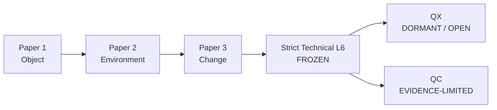
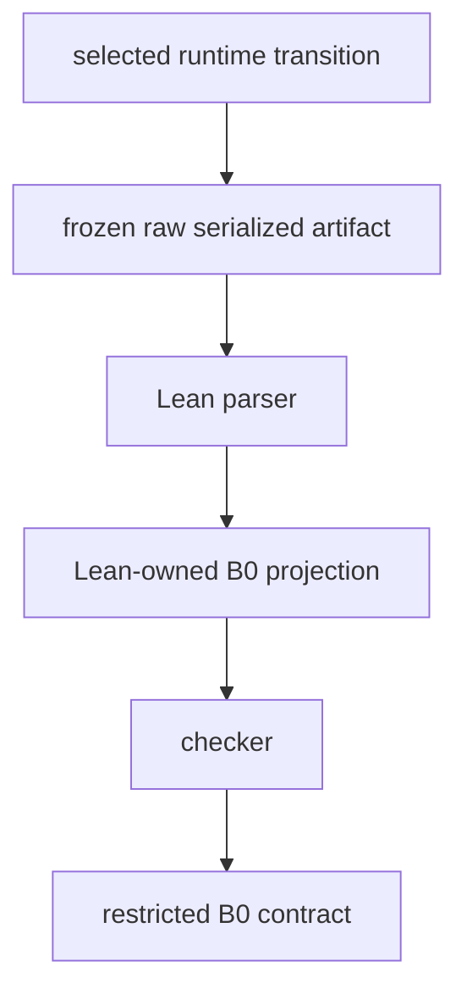

# Responsibility Topology

[](https://github.com/xiongweilin/responsibility_topology/actions/workflows/lean.yml)
[](https://github.com/xiongweilin/responsibility_topology/actions/workflows/conformance.yml)


> **FROZEN RESEARCH ARTIFACT.** This repository is preserved for Lean proof/checker provenance, Strict-L6 evidence, cross-domain formal-similarity results, research governance, and negative-result lineage. It is not an active runtime dependency, not the current Framework definition owner, and not the canonical product-semantics owner. See [`ARCHIVE_STATUS.md`](ARCHIVE_STATUS.md).

Lean 4 formal research on historical responsibility, current qualification, invalidation, repair, and evidence-gated higher-order questions.

`RESEARCH_STATE.md` is the authoritative frozen research-governance state. This README is a public entry point, not the research log.

## Archive position

Current ownership after freeze is deliberately split:

```text
xiongweilin/ratio, 元模型/
    -> current upstream conceptual / Framework definitions

xiongweilin/agent-kernel, contracts/
    -> current canonical product semantics and runtime contracts

xiongweilin/responsibility_topology
    -> frozen formal specializations, theorem/checker/proof artifacts,
       Strict-L6 evidence and negative research memory
```

The `agent-kernel` Python distribution / namespace retains the compatibility name `portable-runtime` / `portable_runtime`. Product adoption of a distinction does not inherit the Lean proof, and this repository does not verify the whole runtime.

## Status

```text
Formal base
  Papers 1–3 ............... FROZEN
  Strict Technical L6 ...... PASS / FROZEN

Research
  QO ....................... ARCHIVED NEGATIVE CONTROL
  QX ....................... DORMANT / OPEN / PRE-FORMAL
  QC ....................... EVIDENCE-LIMITED / PRE-FORMAL

Formal expansion
  QX Lean .................. NO
  QC Lean .................. NO
```

Freeze semantics are deliberately narrow:

```text
TheoryGate ................. CLOSED under current evidence
QX empirical saturation .... NOT ESTABLISHED
QC search saturation ....... NOT ESTABLISHED
RealityHypothesis .......... UNRESOLVED
```

A freeze means the current record does not authorize further construction/formalization. It does **not** mean that reality has been exhaustively searched or that positive cases do not exist. `SEARCH_SCOPE_PROVENANCE.md` records the actual search scope behind the existing freezes and the known coverage limits.

Current maintenance rule:

```text
allowed changes
= Maintenance | Correction | Absorption | EvidenceEvent
```

There is no default next theory step. QX/QC formalization remains closed unless independently strong evidence or a genuinely non-definitional argument changes the authoritative research state.



QX and QC are independent tracks; neither implies or unlocks the other.

## What is formally established

The frozen formal line separates historical structure from state-indexed current qualification and then studies change without rewriting canonical history.

- **Paper 1 — Object / identity:** canonical formation/history is distinct from current usability/qualification.
- **Paper 2 — Environment:** transported historical dependency is distinct from source/target current responsibility; Adopt provenance is distinct from license currentness and context groundedness.
- **Paper 3 — Change:** challenge/invalidation preserves canonical history while currentness may shrink; repair selection is separated from repair realization; inclusion-minimal repair has local private-cut witnesses; reachable revalidation provides a narrow execution bridge.
- **Strict Technical Level 6:** an actual serialized selected runtime transition artifact is parsed by Lean, projected by Lean into restricted B0, and checked against the restricted B0 contract. This boundary is frozen.

The exact raw runtime artifact is vendored under `frozen/strict-l6/` with origin commit and SHA-256 provenance, so reproducing the frozen checker no longer depends on another repository retaining a historical path.

The strict bridge path is:



For detailed theorem and trust boundaries, start with `ARTIFACT.md`, `PAPER_VERSIONS.md`, `STRICT_LEVEL6_TECHNICAL_AUDIT.md`, `CROSS_REPO_RELATION.md`, and `frozen/strict-l6/PROVENANCE.md`.

## Current research status

### QO — archived negative control

The standing/closure operationalization is closed as a negative-control lineage. In particular, review is not standing, reviewability is not closure qualification, and use-sensitive admissibility must remain indexed. Renamed revivals of rejected generic standing/closure predicates are not authorized without new evidence.

### QX — representation inadequacy

Mother question: how can a finite system become entitled to suspect that its current distinction space is inadequate for a relied-upon responsibility task without already possessing the correct refinement?

Current state:

```text
QX: DORMANT / OPEN / PRE-FORMAL
E-WAKE: OPEN / NOT ACTIVELY SEARCHED
T-WAKE: CLOSED FOR CURRENT CANDIDATE FAMILY
Generic QX object: NOT EARNED
QX Lean: NO
```

The only surviving positive structure is one mechanism-specific, narrowed Web-PKI residual concerning contemporaneous institution-accessible evidence that an already task-identified discriminator was not operationally available at the relied-upon boundary. It is not a generic `InsufficiencyCertificate`.

### QC — provisional shared determination

Mother question: how can multiple finite systems become entitled to provisionally share a bounded determination across heterogeneous representations without a final arbiter?

Current state:

```text
QC: EVIDENCE-LIMITED / PRE-FORMAL
source-backed positive residuals: 0
Generic QC object: NOT EARNED
ProvisionalSharedReliance: NOT EARNED
QC Lean: NO
```

QC uses an evidence pipeline that freezes material facts before ordinary decomposition and requires source-disciplined, four-dimensional RivalFit. A distributed object, local agreement, or absence of a global operator does not by itself establish shared determination or shared reliance.

See `RESEARCH_STATE.md` for exact current status, `SEARCH_SCOPE_PROVENANCE.md` for what was and was not actually searched, and `NAVIGATION.md` for the research lineage.

## Explicitly not claimed

This repository does **not** claim:

```text
Python runtime verified;
all runtime transitions verified;
RuntimeStep -> FormalStep* refinement;
external-domain verification;
mechanism similarity across domains;
a universal theory of responsibility;
a generic representation-insufficiency certificate;
a generic provisional-shared-reliance object;
QX or QC Lean formalization;
QX/QC empirical search exhaustion;
QX/QC search saturation;
absence of positive cases in reality.
```

Cross-domain results are formal similarity results under explicit interpretations, not verification of aviation, public law, metrology, medicine, PKI operations, routing operations, or other external institutions.

A clean predicate, constructor, theorem statement, or additional example is not sufficient reason to reopen formalization.

## Read and reproduce

Three reading depths are supported:

```text
~30 seconds   README.md + ARCHIVE_STATUS.md + status badges
~5 minutes    RESEARCH_STATE.md + SEARCH_SCOPE_PROVENANCE.md + NAVIGATION.md
~1 hour+      paper / QO / QX / QC / bridge audit lineage
```

Build the frozen Lean program:

```bash
cd formal
lake build
lake env lean ResponsibilityTopology/Audit.lean
lake env lean ResponsibilityTopology/Paper3Audit.lean
lake env lean ResponsibilityTopology/CrossDomainAudit.lean
lake env lean ResponsibilityTopology/BridgeAudit.lean
lake env lean ResponsibilityTopology/Level6Audit.lean
lake env lean ResponsibilityTopology/StrictLevel6Audit.lean
```

Run the Python–Lean conformance suite from the repository root:

```bash
python -m pip install pytest
python -m pytest -q \
  test_v0122_kernel.py \
  test_v0122_currentness.py \
  test_v0122_conformance.py \
  test_v0122_currentness_conformance.py
```

Verify and Lean-check the vendored Strict-L6 runtime artifact:

```bash
echo "61705ce6d1f2005571ba174232df3aae6d3a64b3b872029dd2156c664732b465  frozen/strict-l6/raw_withdrawal_transition_v1.json" | sha256sum -c -
cd formal
lake env lean --run ResponsibilityTopology/Bridge/RawWithdrawalCli.lean \
  ../frozen/strict-l6/raw_withdrawal_transition_v1.json
```

Useful entry points:

- `ARCHIVE_STATUS.md` — current ownership and archival role after freeze.
- `RESEARCH_STATE.md` — authoritative frozen research governance state.
- `SEARCH_SCOPE_PROVENANCE.md` — audited search scope and the limits of freeze/search-closure claims.
- `NAVIGATION.md` — stable logical index without moving historical provenance files.
- `RESEARCH_DEBT.md` — evidence-gated research debt ledger.
- `PROGRAM_ROADMAP.md` — frozen architecture and stop rules.
- `ARTIFACT.md` / `PAPER_VERSIONS.md` — paper artifact identities.
- `STRICT_LEVEL6_TECHNICAL_AUDIT.md` — current strict bridge boundary.
- `frozen/strict-l6/PROVENANCE.md` — exact runtime-artifact origin and hash.
- `CONTRIBUTING.md` — admissible maintenance, correction, absorption, and evidence-event contributions.
- `CITATION.cff` — repository-level citation metadata.

## Licensing

Source code is licensed under Apache-2.0; research documentation is licensed separately under CC BY 4.0 as described in `LICENSE-DOCS`. Manuscripts under `paper/` are excluded from the documentation license unless an individual file states otherwise.

A Lean theorem is evidence only for its explicit formal statement and premises. It is not evidence of external-domain truth, model adequacy, full runtime refinement, QX, or QC.
